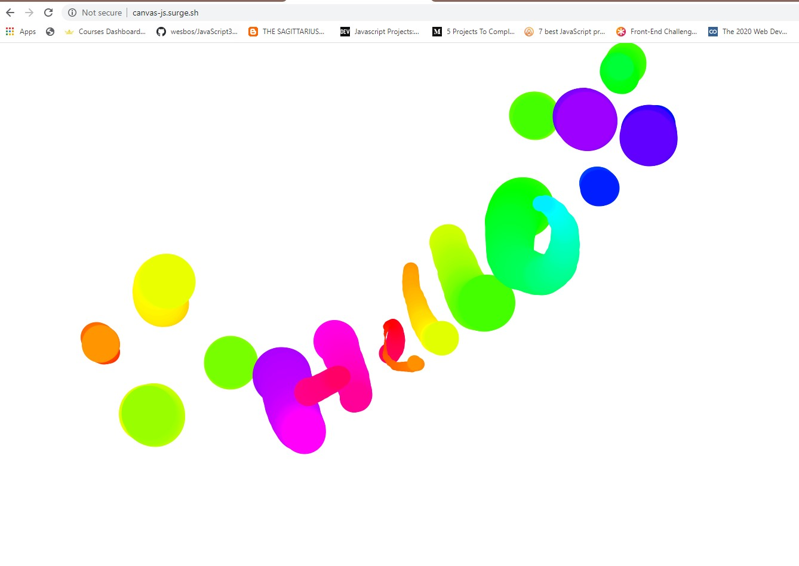

# <h1 align="center"> 👋Welcome to the Canvas🎨 👋 </h1>
Its about using the HTML canvas element & manipulate with JavaScript Canvas API😍

## Live URL
Wanna try it out, I got you covered 😎

Here's the live URL: http://canvas-js.surge.sh/

## How To
This is how the app looks like-

Click your mouse and drag along. That's it!! You are an artist!😎

## Tech I Used
This app is purely made with vanilla JavaScript & raw HTML/CSS. It is to demonstrate, if you can be creative you can make something amazing out of those core technologies.

Key topics-
+ **HTML:** I used Canvas element
+ **JS:** I used Canvas API to build this project

## Disclaimer
+ This is project is part of javascript challenge by Wes Bos namely JavaScript30. Awesome Challenge! Couldn't recommend it more. https://javascript30.com/
